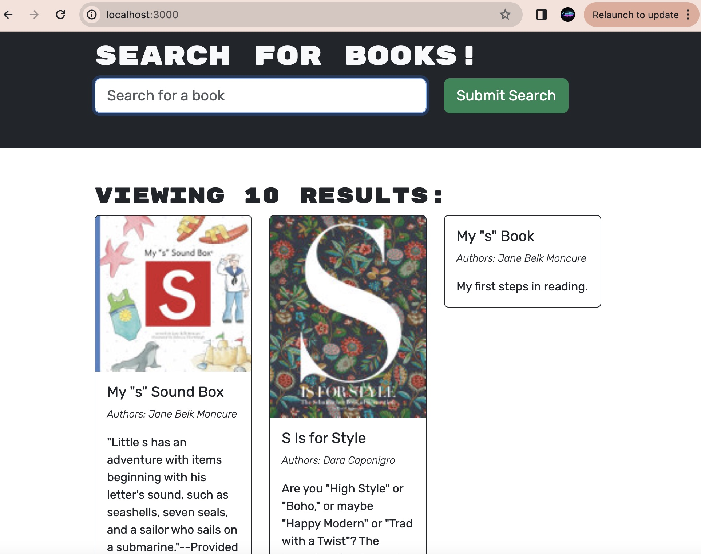

# Book-Search-Engine
The Book Search Engine is an intuitive web application that allows users to search for books using the Google Books API. This application also supports user authentication, enabling users to save and manage their favorite books.

## Features

### User Interface
- **Main Page:** When loading the search engine, users are presented with a clean interface consisting of:
  - A menu with options "Search for Books" and "Login/Signup".
  - An input field to search for books.
  - A submit button.

### Book Search
- **Search Functionality:** Users can search for books by:
  - Clicking on the "Search for Books" menu option, which presents an input field and a submit button.
  - Entering a search term and clicking the submit button, which displays search results including book title, author, description, and an image.
  - Each result has a link to view the book on the Google Books site.

### User Authentication
- **Login/Signup Modal:** Accessible via the "Login/Signup" menu option, featuring:
  - A toggle between Login and Signup options.
  - Signup form with fields for username, email, and password.
  - Login form with fields for email and password.
- **Account Creation and Login:**
  - Upon successful account creation via the signup form, users are automatically logged in.
  - Upon entering valid credentials in the login form, users are logged in and the modal closes.

### Logged-in Features
- **Enhanced Menu Options:** When logged in, the menu changes to:
  - "Search for Books"
  - "My Saved Books" to view books saved to the user's account.
  - "Logout"
- **Save and Manage Books:**
  - Logged-in users can save books to their account using the "Save" button on each search result.
  - Under "My Saved Books", users can view all saved books and remove them from their account using the "Remove" button.

### Logout
- **Session Termination:** Users can log out via the "Logout" button, which logs them out and updates the menu to show "Search for Books" and "Login/Signup" options.

## Setup and Installation

To set up the Book Search Engine locally, follow these steps:

1. Clone the repository: git clone https://github.com/JLJ98/Book-Search-Engine.git
2. Navigate to the project directory:cd Book-Search-Engine
3. Install dependencies: yarn install
4. Start the application: yarn start

This will launch the application on `localhost:3000` in your default web browser.

## Contributing

Contributions to the Book Search Engine are welcome! Please refer to the contributing guidelines for more information.

## License

This project is licensed under the MIT License - see the [LICENSE.md](LICENSE) file for details.

Links: 

## Credits

This project utilizes several tools and resources that have significantly contributed to its development:

- **ChatGPT**: Provided by OpenAI, ChatGPT has been instrumental in generating text-based content and offering coding advice. More information can be found at [OpenAI's website](https://www.openai.com/chatgpt).
  
- **YouTube**: An invaluable resource for educational videos that helped in solving specific coding challenges and learning new technologies. Visit [YouTube](https://www.youtube.com/).

- **Xpert Learning Assistant**: A powerful AI-driven learning assistant that has provided insights and assisted in the learning process throughout the development of this project. More details available on their [official site](https://www.xpert.com).

- **Ask BCS**: Provided real-time coding assistance and troubleshooting solutions which were crucial for the development phases. More about their services can be found [here](https://askbcs.com).

